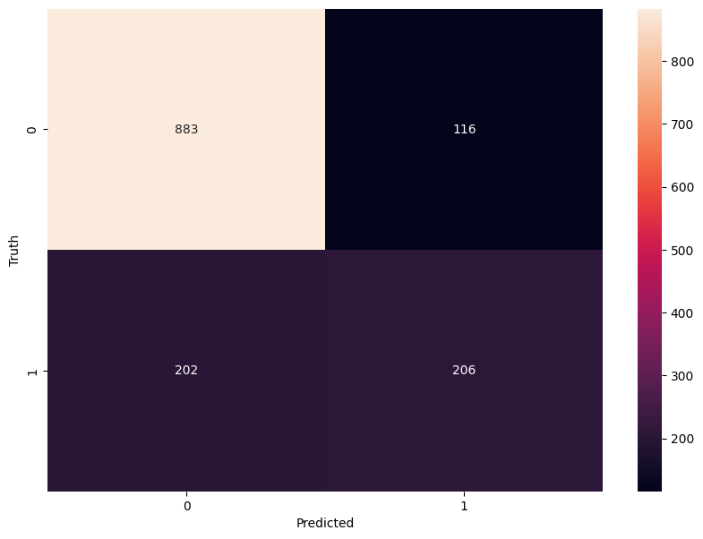

# Customer Churn Prediction Using Artificial Neural Network (ANN)

Customer churn prediction helps businesses understand why customers leave. This project focuses on a telecom dataset and uses an ANN model to predict churn.

---

## 📥 Data Collection and Loading

```python
import pandas as pd
from matplotlib import pyplot as plt
import numpy as np
%matplotlib inline

# Load dataset
df = pd.read_csv("Customer-Churn.csv")
df.sample(5)
```

---

## 🧹 Data Cleaning

### Remove unnecessary column
```python
df.drop('customerID', axis='columns', inplace=True)
```

### Investigate and fix `TotalCharges` type
```python
pd.to_numeric(df.TotalCharges, errors='coerce').isnull().sum()
df1 = df[df.TotalCharges != ' ']
df1.TotalCharges = pd.to_numeric(df1.TotalCharges)
```

---

## 📊 Data Visualization

### Tenure vs Churn
```python
tenure_churn_no = df1[df1.Churn == 'No'].tenure
tenure_churn_yes = df1[df1.Churn == 'Yes'].tenure

plt.hist([tenure_churn_yes, tenure_churn_no], rwidth=0.95, color=['green','red'], label=['Churn=Yes','Churn=No'])
plt.xlabel("Tenure")
plt.ylabel("Number of Customers")
plt.title("Tenure Distribution by Churn")
plt.legend()
plt.show()
```

### Monthly Charges vs Churn
```python
mc_churn_no = df1[df1.Churn == 'No'].MonthlyCharges
mc_churn_yes = df1[df1.Churn == 'Yes'].MonthlyCharges

plt.hist([mc_churn_yes, mc_churn_no], rwidth=0.95, color=['green','red'], label=['Churn=Yes','Churn=No'])
plt.xlabel("Monthly Charges")
plt.ylabel("Number of Customers")
plt.title("Monthly Charges Distribution by Churn")
plt.legend()
plt.show()
```

---

## 🔁 Feature Engineering

### Replace values
```python
df1.replace('No internet service','No', inplace=True)
df1.replace('No phone service','No', inplace=True)
```

### Convert categorical to numerical
```python
yes_no_columns = [
    'Partner','Dependents','PhoneService','MultipleLines','OnlineSecurity','OnlineBackup',
    'DeviceProtection','TechSupport','StreamingTV','StreamingMovies','PaperlessBilling','Churn'
]
for col in yes_no_columns:
    df1[col].replace({'Yes': 1, 'No': 0}, inplace=True)

df1['gender'].replace({'Female': 1, 'Male': 0}, inplace=True)
```

### One-hot encoding
```python
df2 = pd.get_dummies(data=df1, columns=['InternetService','Contract','PaymentMethod'])
```

### Feature scaling
```python
from sklearn.preprocessing import MinMaxScaler

scaler = MinMaxScaler()
cols_to_scale = ['tenure','MonthlyCharges','TotalCharges']
df2[cols_to_scale] = scaler.fit_transform(df2[cols_to_scale])
```

---

## 🧪 Train-Test Split

```python
from sklearn.model_selection import train_test_split

X = df2.drop('Churn', axis='columns')
y = df2['Churn']

X_train, X_test, y_train, y_test = train_test_split(X, y, test_size=0.2, random_state=5)
```

---

## 🧠 Model Building (ANN)

```python
import tensorflow as tf
from tensorflow import keras

model = keras.Sequential([
    keras.layers.Dense(26, input_shape=(26,), activation='relu'),
    keras.layers.Dense(15, activation='relu'),
    keras.layers.Dense(1, activation='sigmoid')
])

model.compile(optimizer='adam', loss='binary_crossentropy', metrics=['accuracy'])
model.fit(X_train, y_train, epochs=100)
```

---

## 📈 Model Evaluation

### Accuracy
```python
model.evaluate(X_test, y_test)
```

### Prediction
```python
yp = model.predict(X_test)

y_pred = [1 if p > 0.5 else 0 for p in yp]
```

### Classification Report
```python
from sklearn.metrics import classification_report

print(classification_report(y_test, y_pred))
```

### Confusion Matrix
```python
import seaborn as sn

cm = tf.math.confusion_matrix(labels=y_test, predictions=y_pred)

plt.figure(figsize=(10,7))
sn.heatmap(cm, annot=True, fmt='d')
plt.xlabel('Predicted')
plt.ylabel('Truth')
plt.show()
```



---

## ✅ Conclusion

- Built an ANN model using TensorFlow/Keras.
- Achieved accurate churn prediction with clean preprocessing and feature engineering.
- Visualizations and metrics like confusion matrix, precision, recall, and F1-score helped assess performance.
